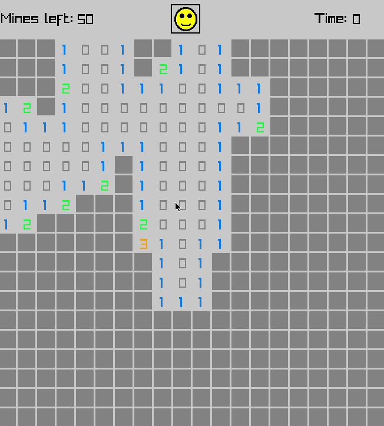

A Minesweeper clone written in C with Raylib



Installation:
```
$ git clone https://github.com/LunarianLime/cSweeper
```

Build the file by running
```
$ cd build && make
```
and run it with
```
$ ./cSweeper
```
